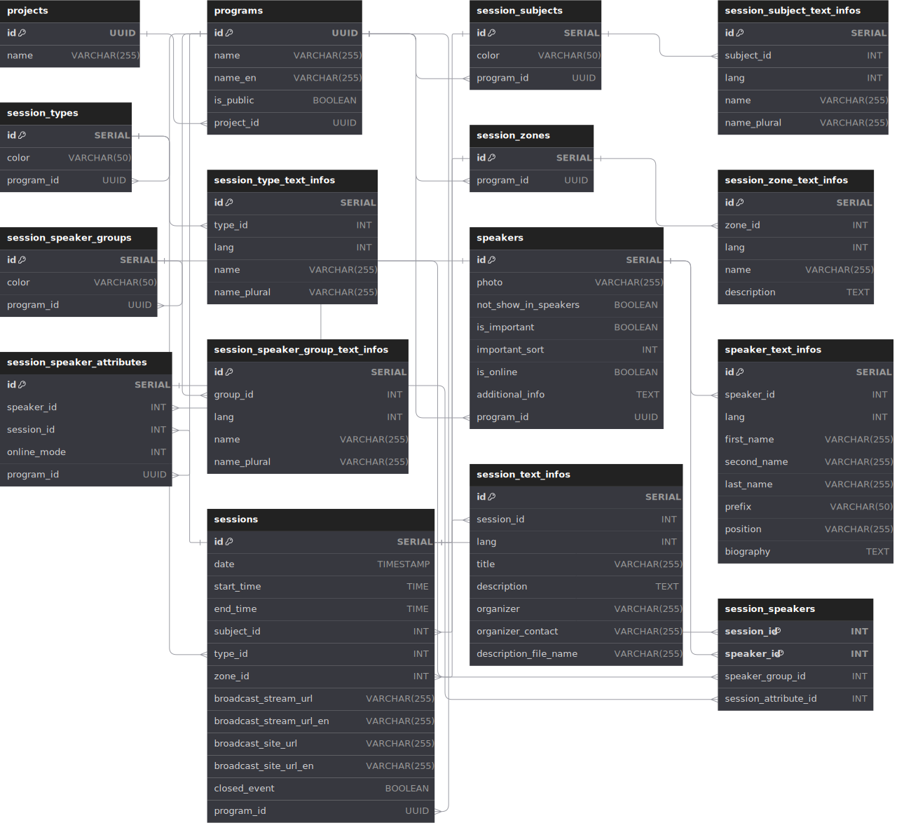

# Инормация о решении задания

### Пакет со структурами на Golang находится в папке pkg/models

1) Файл errors.go содержит структуру ошибки, которая возвращается из API. Ключевая структура, в которую можно преобразовать ответ из JSON - **APIError**.

2) Файл program.go содержит структуру программы. Ключевая структура, в которую можно преобразовать ответ из JSON - **ProgramList**.

3) Файл programlist.go содержит структуру списка программ. Ключевая структура, в которую можно преобразовать ответ из JSON - **ProgramData**.

_В каждую из структур можно преобразовать ответ из JSON, используя библиотеку **encoding/json**, в моем коде этот функционал реализован с сериализацией и десереализацией данных в файлы формата JSON в модуле **pkg/utils/utils.go**._

---
### Структура базы данных

Ссылка на ресурс со схемой базы данных: https://dbdiagram.io/d/Sistyle_programs_table-66d873d6eef7e08f0eaf0589

_Папка с миграциями для создания базы данных Postgres находится по пути internal/migrations_

---
**Важно!**

_Перед выполнением миграций нужно создать базу данных в Postgres. Кроме того, .env файл подгружается по относительному пути, с которго происходит запуск main.go, поэтому если запускать программу из другой папки, нужно будет поменять путь до .env файла, а так же название самого файла с .env.example на .env. В противном случае, программа не сможет подключиться к базе данных._

---

### Пример реализации методов для чтения и записи данных о программах в файл

Все методы для работы с файлами находятся в пакете pkg/utils.

---

### Пример реализации методов для чтения и записи сущности программ в базу данных Postgres

Весь код для работы с базой данных находится в пакете internal/repository.
